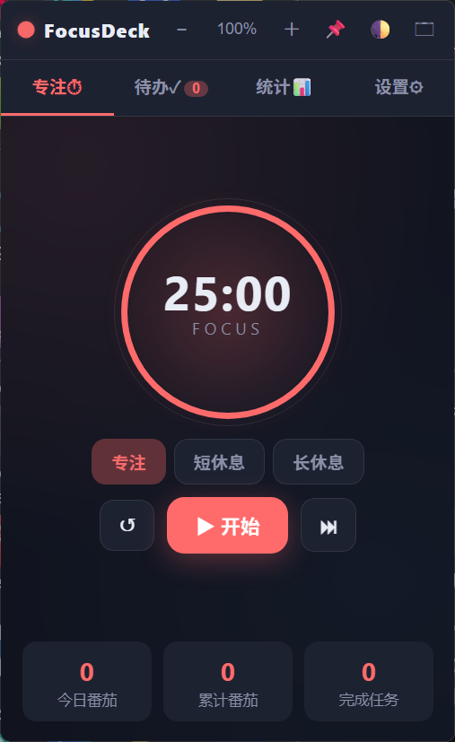

# FocusDeck

一个**轻量、流畅、不卡**的 Windows 专注浮窗：番茄钟 + 任务清单 + 背景光晕呼吸效果。
基于 [pywebview](https://github.com/r0x0r/pywebview) + Edge WebView2，**单文件 exe 即可运行，无需安装**。



## 功能特性

- 🍅 **番茄钟 / 灵活时长**：预设 + 自定义时长，支持双计时并行
- ✅ **任务清单**：待办 / 进行中 / 已完成，本地持久化
- 🌈 **背景光晕**：跟随鼠标 + 呼吸律动，全面走 GPU 合成层，**零全屏重绘、不卡不闪退**
- 🍳 **厨房计时弹窗**：食材预设 / 自定义 / 分步提醒
- 🎵 **专注音乐 / 白噪音**：本地播放，节奏律动联动光晕
- ⚙️ **设置**：主题、窗口透明度、光晕扩散、呼吸强度等

## 下载

前往 [Releases](https://github.com/raojiayong-lab/FocusDeck/releases) 页面，
下载 `FocusDeck.exe`（单文件，约 16MB），双击即可运行。

## 构建（开发者）

需要 Python 3.14 + `pywebview` + `PyInstaller`：

```bash
pip install pywebview PyInstaller
python -m PyInstaller --noconfirm --onefile --noconsole ^
  --name FocusDeck --icon icon.ico ^
  --add-data "index.html;." --add-data "icon.ico;." app.py
```

生成的 `dist/FocusDeck.exe` 即为可分发的单文件程序。

也可以使用仓库里的 `build.bat`（Windows）一键打包。

## 目录结构

```
app.py              # pywebview 外壳 + 本地 API
index.html          # 主界面（CSS + HTML + JS 单文件）
icon.ico            # 程序图标
make_icon.py        # 图标生成脚本
build.bat           # 一键打包（PyInstaller）
FocusDeck.spec      # PyInstaller 配置
```

## 许可证

[MIT](LICENSE) © 2026 raojiayong-lab
